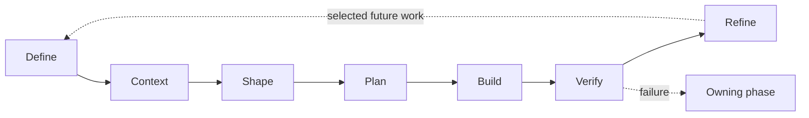

# Development Lifecycle Orchestrator

## Load

Read:

- `references/framework.md`
- `references/questioning.md`
- `references/cycle-log.md`
- `references/approval.md`
- `references/verification-strategy.md`
- `references/third-party-skills.md`

Determine approval mode once and persist it in `00-lifecycle.md`.

## Shared Phase Frame

Use **Decide → Work → Resolve** across all phases:

- **Decide** — phase result/status/next.
- **Work** — only phase-owned information.
- **Resolve** — resolve or route what remains; omit when empty.

This is a mental frame, not a reason to rename the seven phases or force identical headings.

## Orientation

The lifecycle moves from value to context, solution, implementation, proof, and durable learning:

Later findings route back to the phase that owns the problem; the chart is an orientation aid, not a replacement for the phase gates or artifacts.

## Authority

- Lifecycle = process authority.
- Approved phase artifacts = active-change authority.
- `docs/modules/` = permanent module knowledge.
- `docs/guidelines/` = permanent engineering standards.
- Companion skills = techniques only.

## Workspace

Use `docs/lifecycle/<change-name>/`.

Keep:

- `00-lifecycle.md` — state/index.
- phase artifacts as phases begin.
- `cycle-log.md` — temporary improvement memory.

Lifecycle artifacts are temporary working memory. Refine must transfer durable knowledge before cleanup.

## Future Work

- Durable future/deferred module work belongs in the affected `docs/modules/<module>.md`.
- It is not approved scope.
- When selected, it starts a new lifecycle at Define.
- Do not maintain permanent future work only inside lifecycle artifacts.

## Current Phase

Use the latest passed/approved artifact:

- no passed Define → `lifecycle-define`
- Define passed, Context incomplete → `lifecycle-context`
- Context passed, Shape incomplete → `lifecycle-shape`
- Shape passed, Plan incomplete → `lifecycle-plan`
- Plan passed, slices incomplete → `lifecycle-build`
- slices complete, solution unverified → `lifecycle-verify`
- Verify passed, cycle not closed → `lifecycle-refine`

If a later phase invalidates earlier work, route to the owning phase.

## Run One Phase at a Time

1. Invoke the matching `lifecycle-*` skill.
2. Confirm its internal gate passes.
3. Run the Cycle Log sweep.
4. Update `00-lifecycle.md`.
5. Apply approval mode.
6. Move forward only when the gate passes.

Each phase artifact has one decision/status area near the top. Do not require duplicate Exit sections.

## Ownership Discipline

- One fact has one owner.
- Reference upstream decisions instead of rewriting them.
- If an upstream fact/decision changes, route back to its owning phase and update that source.
- Use each phase question as a delete test for artifact content.

## Context Discipline

Load only what the active phase needs:

- `00-lifecycle.md`;
- relevant approved upstream artifacts;
- affected module docs;
- relevant code/config/tests;
- Engineering Guidelines before Build/Verify;
- Cycle Log as required (Refine loads all).

Do not duplicate stable information across artifacts.

## Module Documents

For every bug fix, existing-functionality change, or new functionality:

- Context identifies affected modules.
- Context reads each existing `docs/modules/<module>.md`.
- Missing module docs are recorded as gaps.
- Refine transfers durable learning and future/deferred module work into module docs before cleanup.

## Close the Cycle

Refine owns closure:

- review the completed work and Cycle Log;
- propose/apply approved code improvements;
- transfer durable module knowledge/future work;
- improve engineering/lifecycle guidance when needed;
- reverify applied code changes;
- record cleanup decision;
- ensure the workspace is safe to delete/archive.

> **The orchestrator remembers where we are. The phase skill remembers how to work. Temporary artifacts remember the active change. Permanent sources remember what survives it.**
