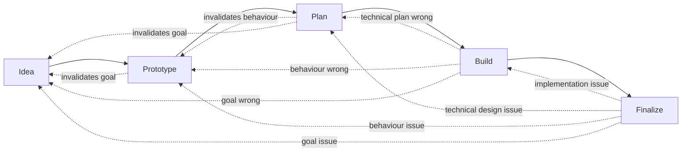

# Development Lifecycle Orchestrator

## Load

Read:

- `references/framework.md`
- `references/artifacts.md`
- `references/questioning.md`
- `references/cycle-log.md`
- `references/guidelines.md`
- `references/companion-skills.md`

## Lifecycle

```mermaid
flowchart LR
    I[Idea] --> P[Prototype] --> L[Plan] --> B[Build] --> F[Finalize]
    P -. invalidates goal .-> I
    L -. invalidates behaviour .-> P
    L -. invalidates goal .-> I
    B -. technical plan wrong .-> L
    B -. behaviour wrong .-> P
    B -. goal wrong .-> I
    F -. implementation issue .-> B
    F -. technical design issue .-> L
    F -. behaviour issue .-> P
    F -. goal issue .-> I
```

## Approval

Always stop:

- after every phase;
- after every Build Step.

Then:

- present the result;
- wait for explicit user approval;
- continue only after approval.

Do not infer approval from silence.

If changes are requested:

- stay in the current phase/step;
- update it;
- present again.

## Authority

- Lifecycle skills = process authority.
- Current phase artifacts = active-change decisions.
- `docs/modules/` = permanent product/module truth.
- `docs/guidelines/` = permanent engineering standards.
- Support/user docs = permanent user-facing truth.
- Companion skills = techniques only.

When sources conflict:

- do not silently choose;
- route the conflict to the owning phase;
- ask the user when a consequential decision remains.

## Workspace

Use `docs/lifecycle/<change-name>/`.

Keep:

- `00-lifecycle.md`;
- one artifact per phase;
- `cycle-log.md`;
- `prototype/` only when useful.

Use `templates/`.

Follow `references/artifacts.md` for every lifecycle document.

## Current Phase

Read `00-lifecycle.md` first when it exists.

Otherwise infer from approved artifacts:

- no approved Idea → `lifecycle-idea`;
- Idea approved, Prototype unresolved/needed → `lifecycle-prototype`;
- Prototype approved/not-needed, Plan incomplete → `lifecycle-plan`;
- Plan approved, Build Steps incomplete → `lifecycle-build`;
- Build approved, cycle not closed → `lifecycle-finalize`.

## Run One Responsibility at a Time

1. Load the active phase skill.
2. Load only the sources that phase needs.
3. Resolve the phase responsibility.
4. Capture finalized points continuously.
5. Run the Cycle Log sweep.
6. Update `00-lifecycle.md`.
7. Present the result.
8. Wait for explicit user approval.
9. Continue only after approval.

## Ownership Routing

When later work changes earlier truth:

- Problem / Goal / Key Results → Idea.
- Behaviour / experience → Prototype.
- Technical solution / proof / build sequence → Plan.
- Implementation / conformance → Build.

Update the owning artifact.

Do not hide the change later.

## Context Discipline

- Idea → current request + needed product facts.
- Prototype → Idea + needed product/project context.
- Plan → Idea + Prototype + relevant code/docs/config/tests/guidelines.
- Build → current Plan step + applicable project rules + nearby patterns.
- Finalize → planned proof + Build results + relevant permanent docs + Cycle Log.

## Permanent Knowledge

During Finalize:

- current product behaviour → module docs;
- user-facing instructions → support/user docs;
- reusable engineering conventions → project guidelines/checkers;
- reusable process lessons → lifecycle skills;
- temporary evidence → clean only after useful learning is preserved.

> **The conversation explores. The artifacts remember. Permanent sources preserve what survives the change.**
