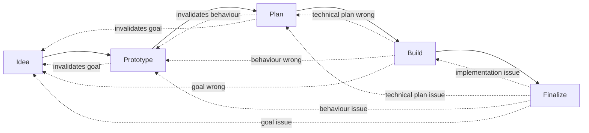

# Development Lifecycle Orchestrator

## Load

Read:

- `references/framework.md`
- `references/models.md`
- `references/artifacts.md`
- `references/questioning.md`
- `references/cycle-log.md`
- `references/guidelines.md`

Before presenting a document, complete the [required compactness pass](references/artifacts.md#required-compactness-pass).

## Lifecycle

```mermaid
flowchart LR
    I[Idea] --> P[Prototype] --> L[Plan] --> B[Build] --> F[Finalize]
    P -. invalidates goal .-> I
    L -. invalidates behaviour .-> P
    L -. invalidates goal .-> I
    B -. technical plan wrong .-> L
    B -. behaviour wrong .-> P
    B -. goal wrong .-> I
    F -. implementation issue .-> B
    F -. technical plan issue .-> L
    F -. behaviour issue .-> P
    F -. goal issue .-> I
```

## Shared Rules

- [Authority](references/framework.md#authority)
- [Approval gates](references/framework.md#approval-gate)
- [Decision ownership](references/framework.md#return-to-the-owner)
- [Development boundary](references/framework.md#development-boundary)
- [Approval state](references/framework.md#approval-state)
- [Coverage and completion](references/completeness.md)
- [Small, testable Build Steps](references/plan.md#vertical-build-steps)

## Workspace

Use `docs/lifecycle/<change-name>/`.

Keep:

- `00-lifecycle.md`;
- one artifact per phase;
- `cycle-log.md`;
- `prototype/` only when useful.

Use `templates/`.

Follow `references/artifacts.md` for every lifecycle document.

## Current Phase

Read `00-lifecycle.md` first when it exists.

Otherwise infer from approved artifacts:

- no approved Idea → `lifecycle-idea`;
- Idea approved, Prototype unresolved/needed → `lifecycle-prototype`;
- Prototype approved/not-needed, Plan incomplete → `lifecycle-plan`;
- Plan approved, Build Steps incomplete → `lifecycle-build`;
- Build approved, cycle not closed → `lifecycle-finalize`.

## Run One Responsibility at a Time

1. Load the active phase skill.
2. Load only the sources that phase needs.
3. Resolve the phase responsibility.
4. Capture finalized points continuously.
5. Run the Cycle Log sweep.
6. Update `00-lifecycle.md`.
7. Present the result.
8. Wait for explicit user approval when the lifecycle gate requires it.
9. Continue only after approval.

## Decision Changes

Update the owning artifact using [Return to the owner](references/framework.md#return-to-the-owner).

## Context Discipline

- Idea → current request + needed product facts.
- Prototype → Idea + needed product/project context.
- Plan → Idea + Prototype + relevant code/docs/config/tests/guidelines.
- Build → current Plan step + applicable project rules + nearby patterns.
- Finalize → complete lifecycle intent + Build results + complete branch diff + relevant permanent docs + Cycle Log.

## Finalize Boundary

Follow the [development boundary](references/framework.md#development-boundary).

## Permanent Knowledge

During Finalize:

- current product behaviour → module docs;
- user-facing instructions → support/user docs;
- reusable engineering conventions → project guidelines/checkers;
- reusable process lessons → lifecycle skills;
- temporary evidence → clean only after useful learning is preserved.

> **The conversation explores. The artifacts remember. Permanent sources preserve what survives the change.**
